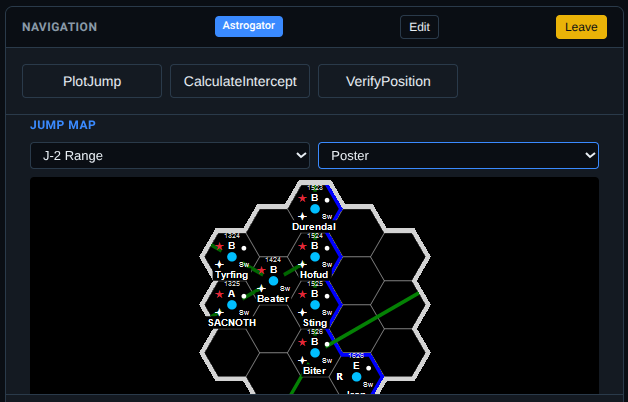

# Traveller VTT for Starship Operations

[](https://github.com/OWNER/traveller-combat-vtt)
[](https://www.gnu.org/licenses/gpl-3.0)
[](https://nodejs.org/)

> A real-time multiplayer Virtual Tabletop (VTT) for Mongoose Traveller 2nd Edition starship operations. Multi-role crew management, campaign persistence, and authentic space combat.


## Overview

Traveller VTT is a web-based virtual tabletop for **Mongoose Traveller 2nd Edition** that puts each player in a specific crew role aboard a starship. The GM manages campaigns while players take roles like Captain, Pilot, Engineer, Gunner, Astrogator, and more—each with their own dedicated control panels.

**Key Features:**
- **11 Crew Roles** with dedicated control panels (Captain, Pilot, Engineer, Astrogator, Gunner, Sensors, Medic, Marines, Cargo, Steward, Damage Control)
- **Campaign Management** - Persistent campaigns with join codes for players
- **Real-time Multiplayer** - WebSocket synchronisation via Socket.io
- **Ship Operations** - Jump plotting, sensor contacts, ship mail, crew status
- **Space Combat** - Authentic Traveller 2E mechanics with 7 ship templates
- **325 Passing Tests** across 32 test suites

**Version:** 0.31

---

## Screenshots

### Login & Campaign Selection

*GM creates campaigns, players join with campaign codes*

### Role Selection

*Players choose from 11 crew roles, each with unique responsibilities*

### Bridge View

*Full bridge interface with Engineering panel, Sensor Display, Crew Status, and Ship Log*

### Astrogator Panel

*Jump plotting with Traveller Map integration and route calculation*

### Ship Mail System

*In-character communications between crew and NPCs*

---

## Features

### Operations Layer (NEW)
- **Campaign Management** - Create campaigns, manage player slots, persistent state
- **11 Crew Roles** - Captain, Pilot, Engineer, Astrogator, Gunner, Sensors, Medic, Marines, Cargo, Steward, Damage Control
- **Role-Specific Panels** - Each role has dedicated controls and displays
- **Ship Systems** - M-Drive, J-Drive, Power Plant, Sensors, Computer status
- **Ship Log** - Timestamped crew actions and system events
- **Ship Mail** - In-game messaging system with NPC contacts
- **Alert Status** - Normal, Yellow, Red alert with visual indicators
- **Jump Maps** - Astrogator jump plotting with Traveller Map API

### Space Combat System
- **Authentic Traveller 2E Mechanics** - 2D6 + skill + modifiers ≥ 8 target
- **7 Ship Templates** - Scout, Free Trader, Far Trader, Patrol Corvette, Mercenary Cruiser, Subsidised Liner, Safari Ship
- **Range Bands** - 7 range bands (Adjacent → Distant) with proper modifiers
- **Weapons System** - Pulse lasers, beam lasers, missiles with authentic damage
- **Critical Hits** - Severity-based effects (1-6) affecting drives, weapons, sensors, crew
- **Initiative System** - 2D6 + Pilot + Thrust + Captain Tactics

### Technical Infrastructure
- **SQLite Database** - Persistent campaign and character storage
- **Real-time Sync** - Socket.io WebSocket communication
- **Docker Ready** - Multi-stage builds with health checks
- **Export/Import** - JSON-based save/load with schema versioning

---

## Built With

### Backend
- **[Node.js](https://nodejs.org/)** (≥18.0.0) - JavaScript runtime
- **[Express](https://expressjs.com/)** (4.18.2) - Web application framework
- **[Socket.io](https://socket.io/)** (4.7.2) - Real-time WebSocket communication
- **[better-sqlite3](https://github.com/WiseLibs/better-sqlite3)** (12.5.0) - SQLite database
- **[Winston](https://github.com/winstonjs/winston)** (3.18.3) - Structured logging

### Frontend
- **Vanilla JavaScript** - No framework dependencies
- **HTML5/CSS3** - Responsive sci-fi themed UI
- **WebSockets** - Real-time bidirectional communication

### Testing
- **[Jest](https://jestjs.io/)** (29.7.0) - Testing framework
- **[Puppeteer](https://pptr.dev/)** (24.29.1) - Browser automation for E2E tests
- **325 tests** across 32 test suites

---

## Installation

### Prerequisites
- **Node.js** v18.0.0 or higher
- **npm** v9.0.0 or higher

### Quick Start

```bash
# Clone the repository
git clone https://github.com/OWNER/traveller-combat-vtt.git
cd traveller-combat-vtt

# Install dependencies
npm install

# Run tests
npm test
# Expected: 325/325 tests passing

# Start server (kills existing port 3000 process, resets DB)
npm start
# Server running at http://localhost:3000
```

### Docker Deployment

```bash
docker build -t traveller-vtt .
docker run -d -p 3000:3000 --name traveller-vtt traveller-vtt

# Health check
curl http://localhost:3000/health
```

---

## Usage

### For Game Masters

1. Open `http://localhost:3000/operations/`
2. Click **GM Login**
3. Create or select a campaign
4. Share the **Campaign Code** with players
5. Start the session when players have joined

### For Players

1. Open `http://localhost:3000/operations/`
2. Click **Player Login**
3. Enter the **Campaign Code** from your GM
4. Import or create your character
5. Select a ship and crew role
6. Click **Join Bridge**

### Crew Roles

| Role | Responsibilities |
|------|------------------|
| **Captain** | Command, tactics, leadership, relieve crew |
| **Pilot** | Navigation, manoeuvring, docking |
| **Astrogator** | Jump plotting, route calculation |
| **Engineer** | Power allocation, repairs, drive management |
| **Gunner** | Weapons, point defence |
| **Sensors** | Detection, comms, electronic warfare |
| **Medic** | Medical care, crew health |
| **Marines** | Security, boarding actions |
| **Cargo** | Cargo operations, loading |
| **Steward** | Passengers, supplies |
| **Damage Control** | Repairs, emergencies |

---

## Testing

```bash
# All tests (325 tests across 32 suites)
npm test

# Unit tests only
npm run test:unit

# Integration tests
npm run test:integration

# Automated browser tests
npm run test:auto
```

---

## Project Structure

```
traveller-combat-vtt/
├── lib/                      # Core game logic
│   ├── operations/           # Operations layer (campaigns, accounts, database)
│   ├── state/                # State management
│   ├── services/             # Rate limiting, metrics
│   ├── socket-handlers/      # Socket.io event handlers
│   ├── combat/               # Combat resolution engine
│   └── ship-*.js             # Ship validation modules
├── data/
│   ├── campaigns/            # SQLite database (operations.db)
│   ├── ships/v2/             # Ship templates (JSON)
│   └── rules/                # High Guard 2022 reference
├── public/
│   ├── operations/           # Operations VTT UI
│   ├── index.html            # Space combat UI
│   └── app.js                # Combat client
├── tests/                    # 325 tests across 32 suites
├── server.js                 # Express + Socket.io (~414 LOC)
├── Dockerfile                # Multi-stage production build
└── package.json
```

---

## Mongoose Traveller 2E Rules

This VTT implements authentic **Mongoose Traveller 2nd Edition** rules:

- **Attack Roll:** 2D6 + Skill + Stat DM + Range DM ≥ 8
- **Effect:** Attack Total - 8
- **Damage:** Weapon Damage + Effect - Armour (minimum 0)
- **Initiative:** 2D6 + Pilot + Thrust + Captain Tactics
- **Range Bands:** Adjacent (+2) → Close (0) → Short (-1) → Medium (-2) → Long (-2) → Very Long (-4) → Distant (-4)

---

## Contributing

Contributions welcome! Please:

1. Read [CONTRIBUTING.md](CONTRIBUTING.md)
2. Write tests first (TDD)
3. Use British spelling ("armour", not "armor")
4. Run `npm test` before committing

---

## License

**Code:** [GNU General Public License v3.0](LICENSE)

**Traveller Content:**
- **Traveller** is a registered trademark of **Far Future Enterprises**
- Used under license by **Mongoose Publishing Ltd.**
- This is an unofficial fan project, not affiliated with or endorsed by Mongoose Publishing or Far Future Enterprises

---

## Acknowledgments

- **Mongoose Publishing** - Mongoose Traveller 2nd Edition
- **Far Future Enterprises** - Original Traveller game system
- **Traveller Map** - Jump map data and API
- **Anthropic Claude Code** - AI-assisted development

---

**Version:** 0.31
**Tests:** 325 passing (32 suites)
**Last Updated:** 2025-12-02
**Created by:** Bruce Stephenson

© 2025 Bruce Stephenson. Open source under GPL-3.0 License.
